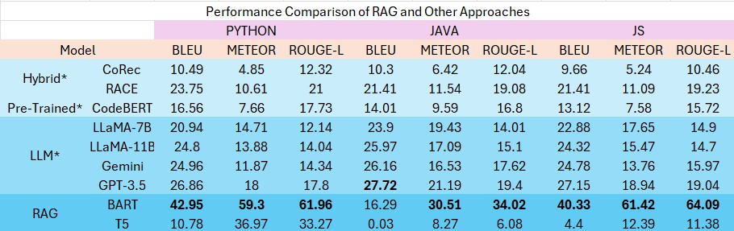

# Automatic Commit Message Generation using Retrieval-Augmented Generation (RAG)

This repository contains a comprehensive implementation of **Automatic Commit Message Generation** using **Retrieval-Augmented Generation (RAG)** techniques. The project explores different programming languages (`Java`, `JavaScript`, and `Python`) and multiple pre-trained transformer models, including **BART** and **T5**, to enhance version control documentation accuracy and efficiency.

## Overview

The objective of this repository is to automate the process of commit message generation by leveraging RAG to combine powerful language modeling with contextual retrieval. The repository is divided into modules corresponding to each language and framework:

- **Languages**: Java, JavaScript, Python
- **Model**: Retrieval-Augmented Generation (RAG) model leveraging transformer-based generators (BART and T5)

This project is structured to provide a unified methodology for commit message generation across diverse codebases and workflows.

---

## Key Features

- **Multi-Language Support**: Implements models for generating commit messages for codebases in Java, JavaScript, and Python.
- **RAG Integration**: Combines generative capabilities with contextually retrieved information to improve the quality of generated messages.
- **Pre-trained Transformer Models**: Uses BART and T5 for fine-tuning on commit message datasets.
- **Performance Metrics**: Evaluates results using **BLEU**, **METEOR**, **ROUGE**.
- **Datasets**: Includes processed datasets (`py.jsonl`, `java.jsonl`, and `js.jsonl`) containing code diffs and corresponding commit messages.

---
## Performance Comparison of RAG and Other Approaches

The table below shows the performance comparison of various approaches, including RAG (BART and T5), Hybrid models, Pre-trained models, and Large Language Models (LLMs) across Python, Java, and JavaScript:



- **Metrics Evaluated**:
  - **BLEU**: Measures overlap between generated and reference commit messages.
  - **METEOR**: Accounts for synonymy and reordering in sentences.
  - **ROUGE-L**: Measures longest common subsequence recall.

- **Key Observations**:
  - **RAG-BART** outperforms other methods in Python and JavaScript for BLEU, METEOR, and ROUGE-L metrics.
  - **GPT-3.5** performs well as a baseline LLM but falls short of RAG-BART in overall performance.
  - **RAG-T5** performs well in METEOR but has lower scores in other metrics.
 
  * P. Xue, L. Wu, Z. Yu, Z. Jin, Z. Yang, X. Li, Z. Yang, and Y. Tan, “Automated commit message generation with large language models: An empirical study and beyond,” *arXiv preprint* arXiv:2404.14824, 2024.
---
## Repository Structure

```plaintext
├── datasets/
│   ├── py.jsonl         # Python dataset with diffs and commit messages
│   ├── java.jsonl       # Java dataset with diffs and commit messages
│   ├── js.jsonl         # JavaScript dataset with diffs and commit messages
├── notebooks/
│   ├── RAG_BART_Joint_Training_java.ipynb   # BART implementation for Java with RAG
│   ├── RAG_BART_Joint_Training_js.ipynb   # BART implementation for JavaScript with RAG
│   ├── RAG_BART_Joint_Training_py.ipynb   # BART implementation for Python with RAG
│   ├── RAG_T5_java.ipynb                  # T5 implementation for Java with RAG
│   ├── RAG_T5_js.ipynb                    # T5 implementation for JavaScript with RAG
│   ├── RAG_T5_py.ipynb                    # T5 implementation for Python with RAG
└── README.md
